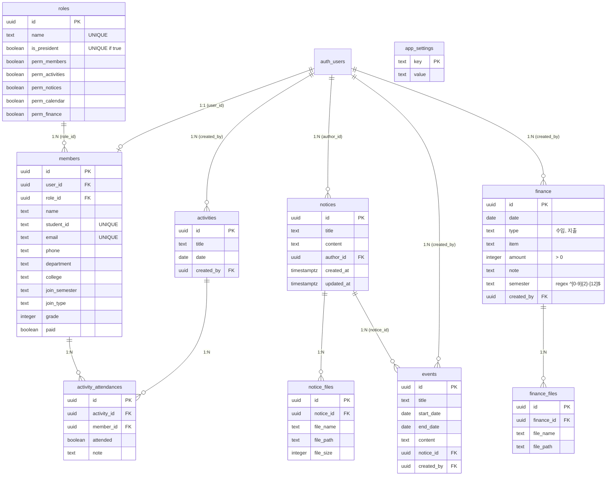

# club-erp
University club management platform with RBAC, attendance, and financial tracking

## Tech Stack
- Frontend: React 18, Vite, Tailwind CSS, Zustand, React Router v6
- Backend: Supabase (PostgreSQL, Auth, Storage, Edge Functions, RLS)
- Deploy: Vercel (Frontend), GitHub Actions (CI/CD)
- Editor: Tiptap (공지 에디터)
- Calendar: FullCalendar

## Documentation
- ERD: [ERDCloud](https://www.erdcloud.com/d/faZvhySPaSoXtv24j)
- API: 추후 Swagger 링크 추가 예정

## Getting Started
(추후 작성)

## Commit Convention

| Type | Description |
|---|---|
| `feat` | 새로운 기능 추가 |
| `fix` | 버그 수정 |
| `design` | UI 변경 (기능 변경 없음) |
| `refactor` | 코드 리팩토링 |
| `chore` | 빌드, 설정 파일 수정 |
| `docs` | 문서 수정 |
| `test` | 테스트 코드 |

### Format
type: 작업 내용

### Example
- feat: 회원 등록 기능 구현
- fix: 출석 상태 저장 오류 수정
- design: 대시보드 레이아웃 수정
- refactor: 회원 서비스 계층 분리
- chore: GitHub Actions 설정 추가
- docs: README 커밋 컨벤션 추가

## Database Schema (ERD)

